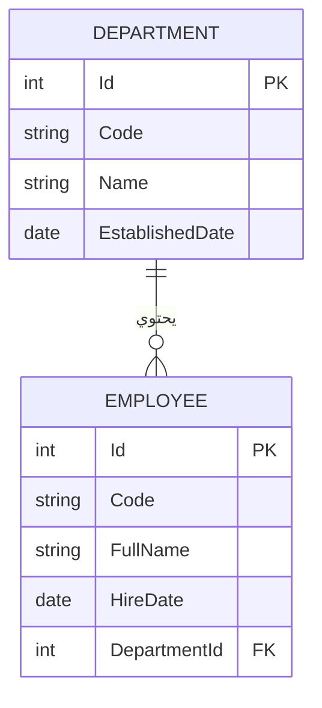

# مخطط قاعدة البيانات ERD

يوضح المخطط التالي العلاقة بين جدول الأقسام وجدول الموظفين في قاعدة البيانات:

```mermaid
erDiagram
    DEPARTMENT ||--o{ EMPLOYEE : يحتوي

    DEPARTMENT {
        int Id PK
        string Code
        string Name
        date EstablishedDate
    }

    EMPLOYEE {
        int Id PK
        string Code
        string FullName
        date HireDate
        int DepartmentId FK
    }
```
